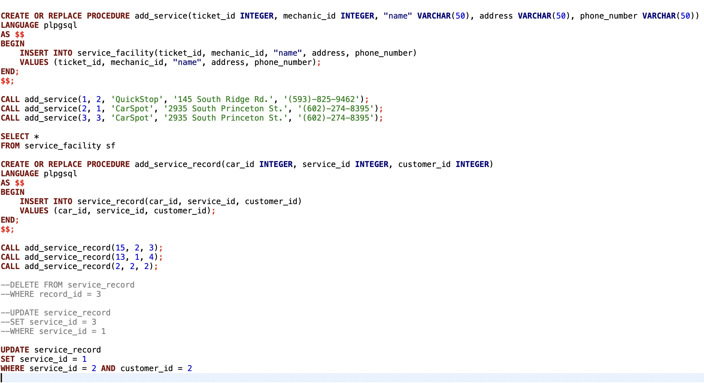
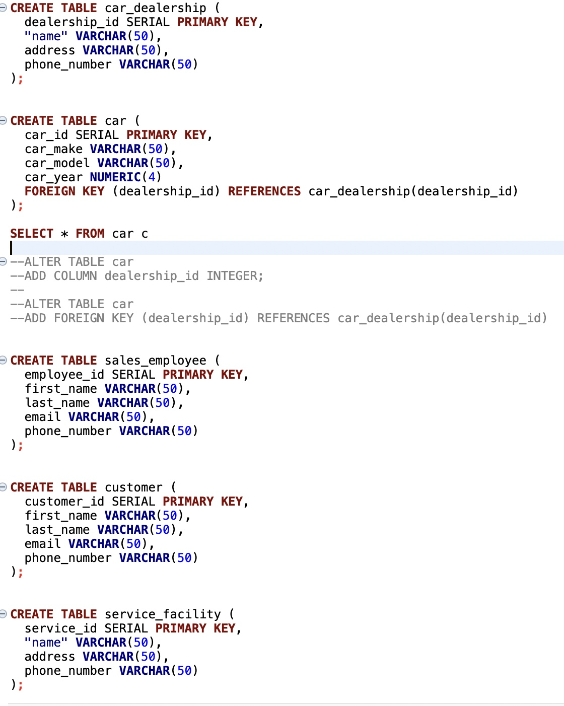

## SQL DATABASE :computer:

In this assignment I learned how to create a database from the planning phase of creating an ERD Diagram to creating the tables to hold the data in SQL along with the stored functions and procedures to sort/search and insert data into my tables.

We used a platform called DBeaver to write our SQL DDL and DML code.

I enjoyed this project because I got to see how data is related to each other in the backend of a website. Also how websites keep track of data.

